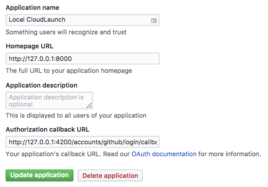
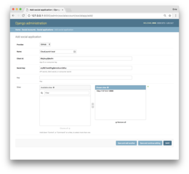
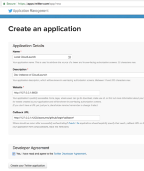

Social Auth Setup
-----------------

After you have setup the server, you will probably want to setup social
auth to be able to log in using an external service. This setup is required
for end-users so they can self register. If you are setting this up on
localhost, use GitHub or Twitter.

Integration with GitHub
~~~~~~~~~~~~~~~~~~~~~~~

1. Register your server with GitHub: Visit your Github account Settings →
   `Developer settings <https://github.com/settings/developers>`_ and add a new
   OAuth application. Settings should look as in the following screenshot. Note
   port 4200 on the *Authorization callback URL*; this needs to match the port on
   which the CloudLaunch UI is served (4200 is the default). Also take note of the
   *Client ID* and *Client Secret* at the top of that page as we'll need that back
   in CloudLaunch.

2. Back on the local server, login to Django admin and change the domain of
   example.com in Sites to ``http://127.0.0.1:8080``. To login to Admin, you'll
   need the superuser account info that was created when setting up the server.

3. Still in Django Admin, now navigate to  *Social Accounts → Social
   applications* and add a new application. Select GitHub as the provider, supply a
   desired application name, and enter the *Client ID* and *Client Secret* we got
   from GitHub. Also choose the site we updated in Step 2.

Save the model and integration with GitHub is complete! You can now log in to
the CloudLaunch UI using Github.

Integration with Twitter
~~~~~~~~~~~~~~~~~~~~~~~~

1. Register your dev server under your Twitter account. Visit
   https://apps.twitter.com/, click *Create New App*, and fill out the form as in
   the following screenthot. Once the app has been added, click on the *Keys and
   Access Tokens* tab and take a note of *Consumer Key (API Key)* and *Consumer
   Secret (API Secret)*.

2. Proceed with the same steps as in the docs about about GitHub integration,
   supplying the *Consumer Key (API Key)* and *Consumer Secret (API Secret)* as the
   values of *Client ID* and *Client Secret* for the new defintion of the Social
   application.
